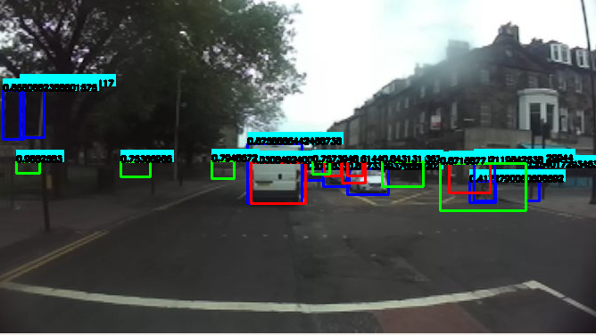
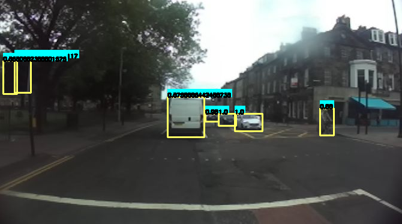

# Camera-Lidar-Radar-Fusion

This repository contains the code necessary to fuse the camera, Lidar and Radar detections using the outputs.

The fusion technique used here is the late fusion following 3 step:

- Look for the association between the two detections
- Bounding boxes fusion 
- Confidence scores fusion 

## **Prerequisites**

Be sure to have the following: 

- Ubuntu 18.04
- ROS2 eloquent

## **Requirements**

* You will need some python libraries. So install them by using pip:

  ```
  pip install -r requirements.txt
  ```

## **How to run**

To run the code, follow these steps: :

  ```
  python3 ./main.py  <path_camera> <path_radar> <path_lidar> 
  ```
You can also run it as follows, if you want to activate the display:

  ```
  python3 ./main.py  <path_camera> <path_radar> <path_lidar> -b Draw_bbox
  ```

The command line arguments are as follows :
- `path_camera` path to folder containing camera detections.
- `path_lidar` path to folder containing lidar detections .
- `path_radar` path to folder containing radar detections.
- `-b draw_bbox` to draw the bounding box befroe and after fusion.

Note : camera, lidar and radar detections are in txt files that must have the same names as input data. 

## **Quick start**

 ```
python3 ./class_radar.py ./data/city/Detection_camera/  ./data/city/Detection_radar/ ./data/city/Detection_lidar/ -b Draw_bbox False False False
 ```

## Result


The red boxes is the result of Lidar detections with (SFA3D). The blue boxes is the result of camera detections with (YOLOV4). The green box is the result of radar detections with (Faster RCNN)


The yellow box is the result of the fusion.



### **Parameters**

In the config_fusion.py file

  
- Ioui_1 : The threshold to create the intersection matrix
- Dist_1 : The eucledian distance to filter what we need to calculate for the intersection matrix
- Ioui_2 : The threshold of the intersection to mix the person and biycle classes with cyclist classes 
- Dist_2 : The distance to mix the person and biycle classes with cyclist classes 
- Iou_3  : The threshold to filter the confidence scores after their fusion
- Iou_s  : The upper threshold to fuse the bbox
- Iou_i  : The lower threshold to fuse the bbox
- heights : objects heights to pass from lidar and radar reference to image reference

## **Acknowledgments**
* [Real-Time Vehicle Detection Framework Based on the Fusion of LiDAR and Camera](https://www.mdpi.com/2079-9292/9/3/451)
* [Object Detection based on Fusing Monocular Camera and Lidar Data in Decision Level Using D-S Evidence Theory ](https://ieeexplore.ieee.org/document/9216767)
* [Improved Dempster-Shafer Sensor Fusion using Distance Function and Evidence Weighted Penalty: Application in Object Detection](https://www.scitepress.org/Papers/2019/79171/79171.pdf)
* For more details on the method, see the deliverables in : https://ardianet.sharepoint.com/sites/Group_SSESolutionFactory_RetD/Documents/General/01-R&D/AD-Perception/06-Internships/2021//2021_Perception_2D3D_Fusion


## **Authors (Expleo)**

* **LADHARI Maroua** - *Maintainer*
* **SEGHAIRI Issam** - *Initial software version & Maintainer*


